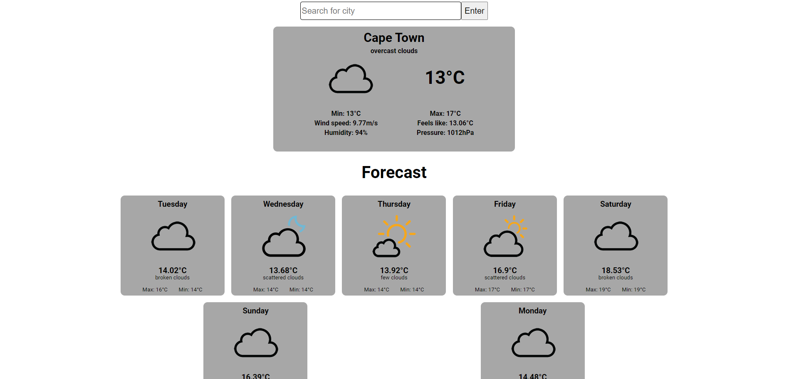

# React Weather App

## Description

This is a straightforward weather application built with ReactJS. Users can search for weather information in cities with populations exceeding 1 million. The app makes use of the OpenWeather API to fetch weather data and utilizes ReactJS to present this information in a clean and user-friendly interface.

### Deployment

This app has been deployed using Vercel and can be found at this [link](https://weather-app-nlod-8hx6ctjyr-ronaldodepao01s-projects.vercel.app/)

### Screenshot

This is a screenshot of the application after a search for a city has been made 
